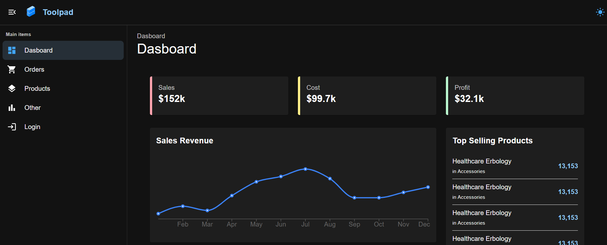

<!-- # React + Vite

This template provides a minimal setup to get React working in Vite with HMR and some ESLint rules.

Currently, two official plugins are available:

- [@vitejs/plugin-react](https://github.com/vitejs/vite-plugin-react/blob/main/packages/plugin-react/README.md) uses [Babel](https://babeljs.io/) for Fast Refresh
- [@vitejs/plugin-react-swc](https://github.com/vitejs/vite-plugin-react-swc) uses [SWC](https://swc.rs/) for Fast Refresh
# admin-panel-of-FastCart -->

# 🛒 FastCart Admin Panel

**FastCart Admin Panel** — это современная, быстрая и интуитивно понятная административная панель для управления интернет-магазином **FastCart**. Построена с фокусом на производительность, удобство работы и расширяемость.

## 📸 Интерфейс



## 🚀 Основные возможности

- 📦 Управление товарами
- 🗂️ Управление категориями и подкатегориями
- 🏷️ Управление брендами
- 🔍 Поиск по товарам
- 📊 Дашборд с графиком продаж и топовыми товарами
- ⚙️ Расширяемая архитектура и чистый код

## 🛠️ Используемые технологии

- **React** — библиотека для построения пользовательских интерфейсов
- **Vite** — мгновенная сборка и запуск проекта
- **Zustand** — лёгкое и эффективное управление состоянием
- **React Router** — маршрутизация страниц
- **Axios** — взаимодействие с API
- **Material UI (MUI)** — библиотека UI-компонентов
- **Recharts** — визуализация данных (графики, диаграммы)

## 📁 Структура проекта

```bash
src/
├── components/         # Переиспользуемые UI-компоненты
├── pages/              # Основные страницы админки
├── stores/             # Zustand состояния
├── services/           # API-запросы и бизнес-логика
└── assets/             # Картинки, иконки, стили


🧪 Планы на будущее

📦 Управление заказами и пользователями

🌍 Поддержка нескольких языков


🧑‍💻 Автор
Shuhrat — разработчик, стремящийся к качественному и понятному коду.
Проект создан с целью упростить управление интернет-магазином и предоставить удобный инструмент для администраторов.

💬 Связь
Если у вас есть идеи или предложения — всегда открыт к диалогу.
Вы можете открыть Issue или создать Pull Request в репозитории.
Также вы можете обрашатьс в инстаграм: @shur_pm
```
